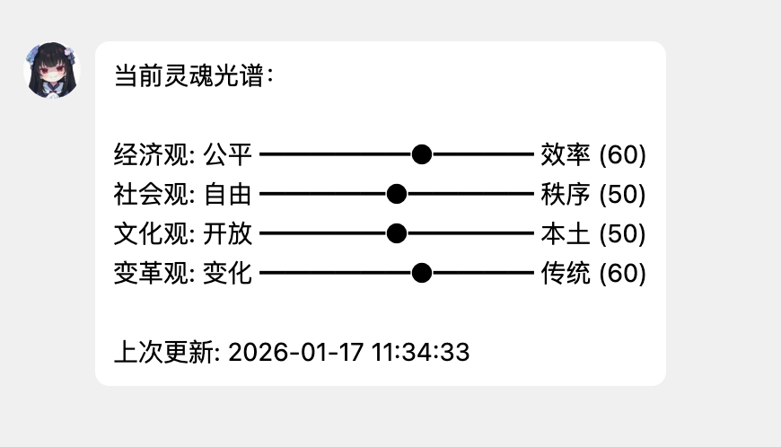

# Mai-Soul-Engine

可被塑造的人格演化系统 - 让MaiBot通过问卷初始化灵魂光谱，并根据群聊内容动态演化，影响回复风格。

## 示例截图



## 开发文档

维护者/二次开发请阅读：`plugins/MaiBot_Soul_Engine/DEVELOPMENT.md`。

## 功能特性

- **问卷初始化**：20道问题设定初始灵魂光谱
- **四维度光谱**：经济观、社会观、文化观、变革观
- **动态演化**：周期性分析群聊内容，自动调整光谱
- **提示词注入**：根据当前光谱向回复注入性格倾向
- **Notion 展示（可选）**：将 traits 同步到 Notion 数据库，便于对外公共展示（你可在 Notion 里自建页面/视图）
- **回弹机制**：光谱值超出边界时可反向变化
- **EMA平滑**：防止光谱剧烈波动，变化更平稳
- **隐私脱敏**：分析前自动过滤敏感信息
- **审计日志**：记录所有演化事件到日志文件
- **WebUI接口**：预留API供前端调用查看状态

## 安装

将 `MaiBot_Soul_Engine` 文件夹放入 `plugins/` 目录即可。

## 配置

请先复制模板：

1) `plugins/MaiBot_Soul_Engine/config_template.toml` → `plugins/MaiBot_Soul_Engine/config.toml`  
2) 按需修改 `config.toml`

```toml
[admin]
admin_user_id = "qq:123456"  # 管理员用户ID（必填，格式：平台:ID）
enabled = true

[evolution]
evolution_enabled = true
evolution_interval_hours = 1.0  # 演化周期（小时）
evolution_rate = 5  # 每次最大变化值
ema_alpha = 0.3  # EMA平滑系数（0-1，越大变化越快）
direction_resistance = 0.5  # 反向变动阻力（0-1）
max_messages_per_analysis = 200  # 每次分析的最大消息数
max_chars_per_message = 200  # 每条消息的最大字符数

[monitor]
monitored_groups = ["qq:123456:group", "telegram:789012:group"]  # 监控的群ID（空=不分析任何群）
excluded_groups = []  # 排除的群ID
monitored_users = []  # 监控的用户ID（格式：平台:ID）
excluded_users = []  # 排除的用户ID（格式：平台:ID）

[threshold]
enable_extreme = false  # 启用极端档位(98-100触发)
custom_prompts = {}  # 自定义提示词（可选）

[injection]
scope = "global"  # 群聊注入范围：global=所有群，monitored_only=仅 monitored_groups（仍受 excluded_groups 影响）
inject_private = true  # 是否允许私聊注入（默认开启）
max_traits = 3  # 每次注入最多携带的 trait 数量
fallback_recent_impact = true  # 当无 tags 命中时，是否 fallback 注入“最近影响最大”的 traits（避免完全空窗）
trait_cooldown_seconds = 180  # trait 冷却时间（秒）。冷却期间同一 trait 不会被重复注入（避免刷屏）

[thought_cabinet]
enabled = false  # 启用思维阁系统（默认关闭）
max_seeds = 20  # 思维种子上限
min_trigger_intensity = 0.7  # 最小触发强度
admin_notification_enabled = true  # 启用管理员审核通知
auto_dedup_enabled = true  # 自动合并相似 trait（去重，避免同义 trait 越积越多）
auto_dedup_threshold = 0.78  # 自动去重阈值（0-1，越高越严格）

[api]
enabled = true
token = ""  # 为空表示不启用 Token 校验；也可用环境变量 SOUL_API_TOKEN 覆盖
```

### ID 格式说明

- **用户ID**：`平台:ID`，如 `qq:768295235`
- **群ID**：`平台:群号:group`，如 `qq:123456:group`（也可直接填写 stream_id）

## 使用方法

### 1. 初始化灵魂光谱

管理员私聊发送：
```
/soul_setup
```

依次回答20道问题（1-5分），按提示使用 `/soul_answer <1-5>` 完成初始化。

### 2. 查看当前状态

任意用户发送：
```
/soul_status
```

显示当前四维度光谱值。

### 3. 重置灵魂光谱

管理员发送：
```
/soul_reset
```

重置为中立状态。

### 4. 思维阁（可选，推荐作为主体验点）

启用：
```toml
[thought_cabinet]
enabled = true
```

思维阁会在每次群聊演化时（见 `monitor.monitored_groups`）产出少量待审核「思维种子」，并通知管理员私聊（可关）。

管理员命令：

- 查看待审核种子：`/soul_seeds`
- 批准内化：`/soul_approve <seed_id>`（会创建 `trait_id` 并固化为 trait，用于后续回复注入）
- 拒绝并删除种子：`/soul_reject <seed_id>`
- 查看已固化 traits：`/soul_traits`（可选：`/soul_traits <stream_id>`）
- 设置 trait tags：`/soul_trait_set_tags <trait_id> <tag1 tag2 / tag1,tag2>`
- 合并 trait：`/soul_trait_merge <source_trait_id> <target_trait_id>`（合并后 source 会被软删除）
- 禁用 trait：`/soul_trait_disable <trait_id>`
- 启用 trait：`/soul_trait_enable <trait_id>`
- 删除 trait：`/soul_trait_delete <trait_id>`（软删除）

#### tags/关键词（非常重要）

traits 的注入选择优先依赖 tags：当一条消息文本命中某个 trait 的 tags 时，该 trait 才会被挑选进入注入（最多 3 条）。

tags 的来源：
- `/soul_approve` 内化时，LLM 会给出一组初始 tags（可用但不一定准）
- 你可以用 `/soul_trait_set_tags` 手工调整，使命中更贴题、更稳定

当无 tags 命中时（或命中为空），可选启用 fallback：
- `injection.fallback_recent_impact = true`：注入“最近影响最大”的 traits，避免完全空窗
- `injection.trait_cooldown_seconds`：为 trait 加冷却，避免同一 trait 连续刷屏

#### 形成证据与置信度（便于理解“怎么得来的”）

每个 trait 会记录：
- `evidence`：来源片段（来自群聊原始对话的引用/摘要，随 seed 一起产生并随合并累计）
- `confidence`：0-1 的置信度（用于表示该 trait 是否“值得内化/稳定”）

## 意识形态维度

| 维度 | 左端（0） | 右端（100） | 影响范围 |
|------|-----------|-------------|----------|
| **经济观** | 重视公平 | 重视效率 | 职场、劳资、内卷等话题 |
| **社会观** | 重视自由 | 重视秩序 | 群规、隐私、道德等话题 |
| **文化观** | 开放包容 | 本土优先 | 外来文化、亚文化等话题 |
| **变革观** | 拥抱变化 | 珍视传统 | 新技术、新观念、婚育等话题 |

## WebUI 接口

### 展示前端（可选部署）

本插件的“展示前端”是**可选**的：不部署任何前端也不影响插件运行（光谱/traits 仍会注入影响回复风格）。  
如需对外公共展示，你可以二选一：

- **Mai‑Soul‑Archive**：独立静态站点（更像传统 WebUI）
- **Notion**：插件同步到 Notion 数据库，你用 Notion 自建页面/视图做公共展示（更偏内容运营/外部分享）

### Soul HTTP API（生产对接用）

插件会自动注册一组 HTTP 接口（匹配 `mai-soul-archive` 前端的 `/api/v1/soul/*` 合同）：

- `GET /api/v1/soul/spectrum`
- `GET /api/v1/soul/cabinet`
- `GET /api/v1/soul/introspection`（兼容 `GET /api/v1/soul/fragments`）
- `GET /api/v1/soul/pulse`
- `GET /api/v1/soul/targets`
- `GET /api/v1/soul/injection`
- `GET /api/v1/soul/injections`
- `GET /api/v1/soul/trait_merge_suggestions`
- `GET /api/v1/soul/health`
- `GET /api/v1/soul/export`

默认注册到 **Core Server**：`http://HOST:PORT/api/v1/soul/*`

### 版本与迁移（重要）

本插件同时维护两类版本号：

1) **插件版本（SemVer）**：`plugins/MaiBot_Soul_Engine/_manifest.json` 的 `version`
- `MAJOR`：存在破坏性变更（配置键移除/语义变更、API 破坏性调整、数据库不可自动兼容的结构变更等）
- `MINOR`：新增功能且保持向后兼容（新增可选配置/新增只读 API/新增字段等）
- `PATCH`：仅修复 bug / 文档，不改变对外行为

2) **API Schema 版本**：`plugins/MaiBot_Soul_Engine/webui/http_api.py` 的 `SCHEMA_VERSION`
- 只要 **API 合同发生变化**（新增/修改字段、增加新端点等）就递增
- 前端可通过 `GET /api/v1/soul/health` 的 `schema_version` 做兼容判断/提示更新

#### 数据库迁移策略

为保证“可迁移、可回滚”：

- 所有数据库表结构变更都通过 `init_tables()` 执行 **幂等迁移**（仅 `ALTER TABLE ADD COLUMN`，并提供默认值）
- 升级后首次运行会自动补齐缺失字段；旧数据不会丢失
- 降级不会自动移除新字段（SQLite 不支持安全的列删除）；如需严格降级请备份数据库后手工处理

#### 按群查看/切换（stream_id）

以下接口支持 `stream_id` 查询参数（用于前端「按群查看/切换」）：

- `GET /api/v1/soul/cabinet?stream_id=<stream_id>`
- `GET /api/v1/soul/introspection?stream_id=<stream_id>`
- `GET /api/v1/soul/injection?stream_id=<stream_id>`
- `GET /api/v1/soul/injections?stream_id=<stream_id>`
- `GET /api/v1/soul/trait_merge_suggestions?stream_id=<stream_id>`

#### 鉴权

当配置了 Token（或环境变量覆盖）后，所有请求需携带请求头：
`X-Soul-Token: <token>`

```toml
[api]
enabled = true
token = ""  # 为空表示不启用 Token 校验；也可用环境变量 SOUL_API_TOKEN 覆盖
public_mode = false # 公共展示模式：对外展示时减少/脱敏敏感字段（targets、evidence、注入细节等）
```

#### 公共展示模式（api.public_mode）

当你把配套前端部署到公网做“对外公共展示”时，建议在后端开启：

```toml
[api]
public_mode = true
```

开启后端公共模式会对接口做脱敏/降能力（避免仅靠前端隐藏导致数据仍可被直接请求抓取），主要行为：
- `GET /api/v1/soul/targets` 返回空列表（隐藏群/会话信息）
- `GET /api/v1/soul/trait_merge_suggestions` 返回空建议（隐藏治理信息）
- `GET /api/v1/soul/injection` / `GET /api/v1/soul/injections` 去除命中详情（`picked` 为空等）
- `GET /api/v1/soul/cabinet` 隐藏 trait 的 `evidence`，隐藏 slots 的 `introspection/debug_params`
- `GET /api/v1/soul/introspection` 内容统一返回 `[REDACTED]`

### Soul Archive 前端（独立部署）

`mai-soul-archive` 是本插件的独立前端工程（与 MaiBot 内置 WebUI 相互独立），用于可视化展示：
- Spectrum（光谱）
- Cabinet（思维阁）
- Introspection（内省）

仓库：https://github.com/CharTyr/mai-soul-archive

#### 推荐部署方式（同域反代，最省心）

生产环境推荐使用反向代理将前端静态资源与 `/api/v1/soul/*` 统一到同域名下：

1) 部署前端（静态文件）  
2) 反向代理 `/api` 到 MaiBot 的 `HOST:PORT`（默认 `127.0.0.1:8000`）  
3) 可选：在后端启用 `api.token`，并对站点做额外访问控制（避免 Token 暴露）

示例（Nginx，按需调整域名/路径）：

```nginx
server {
  listen 80;
  server_name soul.example.com;

  # 前端静态站点
  root /var/www/mai-soul-archive;
  index index.html;
  location / {
    try_files $uri $uri/ /index.html;
  }

  # 代理 Soul API 到 MaiBot Core Server
  location /api/ {
    proxy_pass http://127.0.0.1:8000;
    proxy_set_header Host $host;
    proxy_set_header X-Real-IP $remote_addr;
    proxy_set_header X-Forwarded-For $proxy_add_x_forwarded_for;
  }
}
```

#### 关于 Token（重要）

`api.token` 是共享密钥。若你把前端公开部署到公网，并在前端通过环境变量写死 token（如 `VITE_SOUL_API_TOKEN`），token 会进入前端 bundle，等价于公开。

建议做法：
- **内网/同机部署**：`api.token` 为空，依赖网络边界（推荐起点）
- **公网部署**：用反代统一同域，并对站点加登录/内网/VPN/BasicAuth 等访问控制；再启用 `api.token` 作为额外保护
  - 或者将 API 仅暴露在内网，通过网关统一鉴权（更推荐）

### Notion 前端（公共展示，可选）

如果你不想部署 `mai-soul-archive`，也可以让插件把 **traits + 意识形态光谱** 同步到 Notion 数据库，然后在 Notion 里基于数据库自己做公共展示页面（筛选/排序/分组/画廊）。

#### 你需要在 Notion 侧准备什么

1) 创建 Integration：`https://www.notion.so/my-integrations` → `New integration`  
2) 新建 **traits 数据库**（表），并创建字段（建议命名如下；如需改名，可在插件配置里改字段映射）：  
   - `Name`（Title）
   - `TraitId`（Rich text，用于去重/更新）
   - `Tags`（Multi-select）
   - `Question`（Rich text）
   - `Thought`（Rich text）
   - `Confidence`（Number，0-100）
   - `ImpactScore`（Number）
   - `Status`（Select：Active/Disabled/Deleted）
   - `Visibility`（Select：Public/Internal...）
   - `UpdatedAt`（Date）
3) 新建 **光谱数据库**（表），并创建字段（用于展示意识形态光谱，建议独立数据库，推荐你现在这种“4 行 + Value”的结构）：  
   - `Dimension`（Title：Economic/Social/Diplomatic/Progressive 四行）
   - `ScopeId`（Rich text 或 Select：固定 `global`）
   - `Value`（Number：0-100）
   - （可选）`UpdatedAt`（Date：同步时间）
   - （可选）`Initialized`（Checkbox）
   - （可选）`LastEvolution`（Date）
4) 将这两个数据库所在页面 **Share 给 Integration（Can edit）**  
5) 获取 ID：
   - `database_id`：traits 数据库 ID（复制链接取 32 位 ID，带不带短横线都行）
   - `spectrum_database_id`：光谱数据库 ID

#### 插件侧配置（推荐用环境变量放 token）

```toml
[notion]
enabled = true
database_id = "xxxxxxxxxxxxxxxxxxxxxxxxxxxxxxxx"
spectrum_database_id = "yyyyyyyyyyyyyyyyyyyyyyyyyyyyyyyy"
token = "" # 推荐留空，使用环境变量 MAIBOT_SOUL_NOTION_TOKEN
sync_spectrum = true
spectrum_mode = "dimension_rows"
visibility_default = "Public"         # 你的选择：新建时直接 Public
never_overwrite_user_fields = true    # 你的选择：永不覆盖可编辑字段
```

环境变量示例：
`MAIBOT_SOUL_NOTION_TOKEN="secret_xxx"`

#### 同步策略（重要）

- **仅公共展示**：不会把聊天原文、evidence、注入命中细节等敏感信息写入 Notion，只同步 trait 的「公开结构化信息」。
- **新建时直接 Public**：新 trait 首次写入时会设置 `Visibility=Public`（可在 Notion 侧手动改为 Internal 并用视图过滤）。
- **永不覆盖可编辑字段**：一旦页面创建，插件不会再更新 `Name/Question/Thought/Visibility`，方便你在 Notion 里润色公开展示文案。
- **光谱同步**：会在光谱数据库里 upsert 一条 `ScopeId=global` 的记录，用于展示四维光谱与是否已初始化。

### Python API（开发/调试用）

插件仍提供以下 Python 层函数（供脚本或自定义 WebUI 调用）：

```python
from plugins.MaiBot_Soul_Engine.webui.api import (
    get_current_spectrum,
    get_evolution_history,
    get_spectrum_chart_data,
    manual_evolution,
    set_spectrum,
)

# 获取当前光谱
spectrum = await get_current_spectrum()

# 获取演化历史
history = await get_evolution_history(limit=100)

# 获取图表数据
chart_data = await get_spectrum_chart_data(days=30)

# 手动触发演化
result = await manual_evolution(group_id="qq:123456:group")

# 手动设置光谱
result = await set_spectrum(economic=60, social=40, diplomatic=70, progressive=50)
```

## 工作原理

1. **初始化**：问卷回答通过计分算法转换为四个维度的0-100数值
2. **提示词注入**：每次回复前，根据当前光谱值选择对应档位的提示词注入
3. **周期演化**：每周期分析监控群的聊天内容，用LLM评估对灵魂光谱的影响，调整光谱
4. **回弹机制**：当光谱值接近0或100时，反向变化会推动回弹

## 高级功能

### EMA平滑

使用指数移动平均防止光谱剧烈波动。通过 `ema_alpha` 配置系数：
- 值越大（接近1）：变化越快，响应越灵敏
- 值越小（接近0）：变化越慢，越稳定
- 默认值 0.3 适合大多数场景

### 隐私脱敏

分析群聊内容前自动过滤敏感信息：
- URL → `<url>`
- 邮箱 → `<email>`
- 手机号 → `<phone>`
- QQ号 → `<qq>`
- 身份证号 → `<id>`
- 长数字串 → `<num>`

### 审计日志

所有演化事件记录到 `data/audit.jsonl`：

```json
{"ts": "2026-01-16T01:45:00", "type": "evolution", "group_id": "qq:123:group", "before": {"economic": 50}, "after": {"economic": 52}, "deltas": {"economic": 2}, "message_count": 42}
{"ts": "2026-01-16T01:30:00", "type": "init", "admin_id": "qq:768295235", "spectrum": {"economic": 45, "social": 55, "diplomatic": 50, "progressive": 60}}
{"ts": "2026-01-16T02:00:00", "type": "reset", "admin_id": "qq:768295235"}
```

## 注意事项

- 必须先配置 `admin_user_id` 才能使用
- 只有管理员可以执行 `/soul_setup` 和 `/soul_reset`
- 演化任务需要配置 `monitored_groups` 才会生效
- 自定义提示词可覆盖默认的价值观描述

## 思维阁系统

思维阁是一个灵感来源于极乐迪斯科的深层思维内化系统。它从群聊中识别有价值的思维触发事件，经过管理员审核后内化为深层观点，并直接影响意识形态光谱。

### 启用思维阁

在配置文件中启用（默认关闭）：

```toml
[thought_cabinet]
enabled = true                    # 启用思维阁系统
max_seeds = 20                    # 思维种子上限
min_trigger_intensity = 0.7       # 最小触发强度
admin_notification_enabled = true # 启用管理员审核通知
```

### 思维类型

| 类型 | 说明 |
|------|------|
| 道德审判 | 对是非善恶的判断和立场 |
| 权力质疑 | 对权力结构和社会秩序的质疑 |
| 存在焦虑 | 对存在意义和人生价值的思考 |
| 集体认同 | 对群体归属和身份认同的思考 |
| 变革渴望 | 对现状改变和未来发展的渴望 |

### 工作流程

1. **检测**：演化分析时同时检测思维触发事件
2. **创建种子**：符合条件的事件创建为待审核的思维种子
3. **管理员审核**：管理员收到通知，决定是否内化
4. **内化**：批准后，LLM进行深层内化，形成固化观点
5. **影响光谱**：固化观点直接影响意识形态光谱数值

### 管理命令

```
/soul_seeds              # 查看所有待审核的思维种子
/soul_approve <种子ID>   # 批准思维种子内化
/soul_reject <种子ID>    # 拒绝思维种子
/soul_traits             # 查看已固化 traits
/soul_trait_disable <id> # 禁用 trait
/soul_trait_enable <id>  # 启用 trait
/soul_trait_delete <id>  # 删除 trait（软删除）
```

### 存储方式

思维种子与固化 trait 均存储在插件数据库表中（`soul_thought_seeds` / `soul_crystallized_traits`），不依赖 LPMM 知识库。

## 许可证

GPL-3.0-or-later
